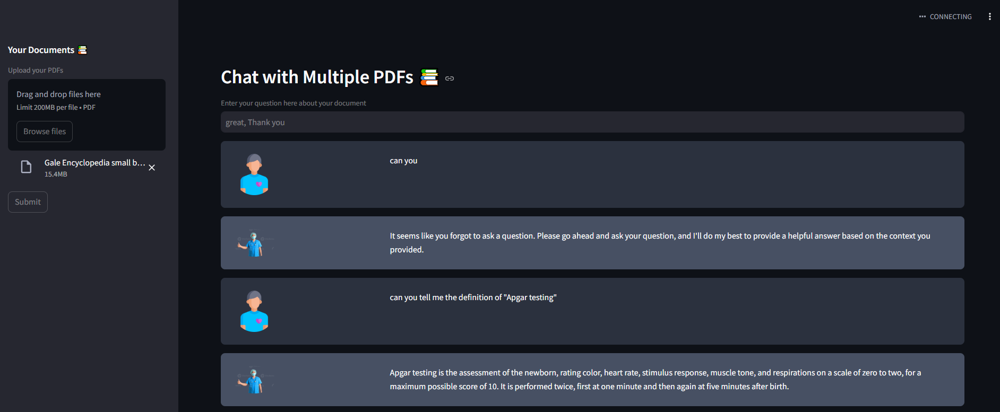

---

# MedibotWithGaleEncyclopedia

Medibot is an AI-powered chatbot designed to assist with medical queries by processing uploaded medical PDFs, such as the Gale Encyclopedia. It uses the **Groq Llama model** for inferencing, the **Google Embedding 006 model** for document embedding, and the **FAISS database** for efficient document retrieval.



## Features

- **Query Handling**: Responds to medical-related queries based on uploaded PDFs.
- **PDF Upload**: Users can upload multiple medical PDFs for Medibot to analyze and extract information from.
- **Advanced Models**:
   - **Groq Llama Model**: Used for inferencing, providing accurate answers based on the uploaded content.
   - **Google Embedding 006 Model**: Embeds documents to help the bot understand and represent PDF content.
   - **FAISS Database**: Stores and efficiently retrieves document embeddings, enabling fast similarity searches for relevant information.

## Installation

1. Clone the repository:
   ```bash
   git clone https://github.com/your-username/medibot.git
   ```

2. Navigate to the project directory:
   ```bash
   cd medibot
   ```

3. Install the required dependencies:
   ```bash
   pip install -r requirements.txt
   ```

## Usage

1. Start the application.
2. Upload medical PDF files (e.g., Gale Encyclopedia).
3. Ask your medical-related questions, and Medibot will provide answers based on the content of the uploaded PDFs.

## Requirements

- Python 3.10
- ".env" file with Groq API key & Google Gemini key
- Libraries specified in `requirements.txt`
- Medical PDFs (e.g., Gale Encyclopedia)